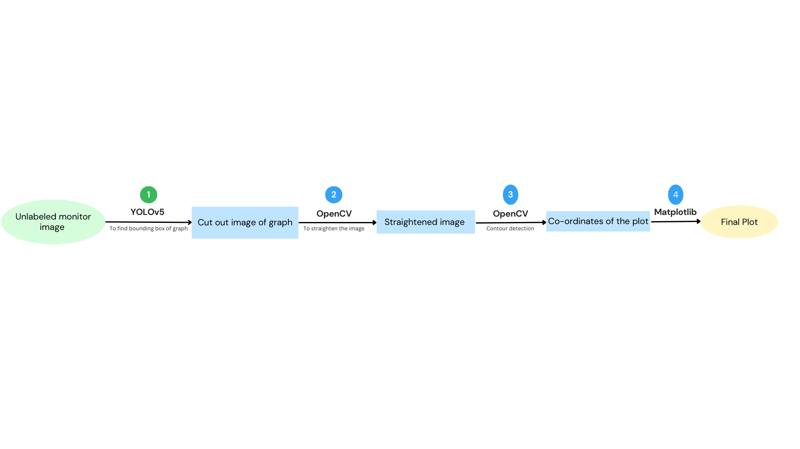
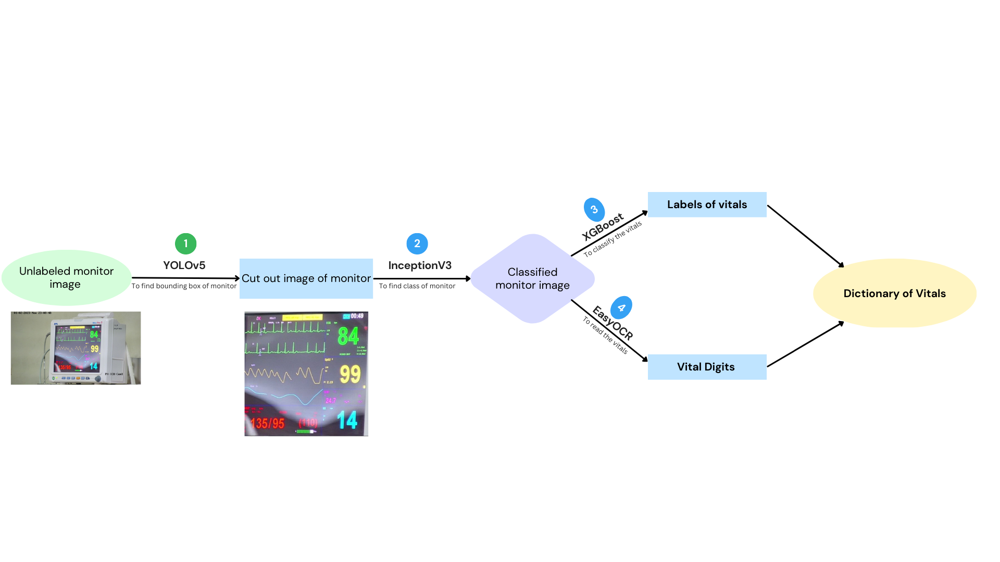
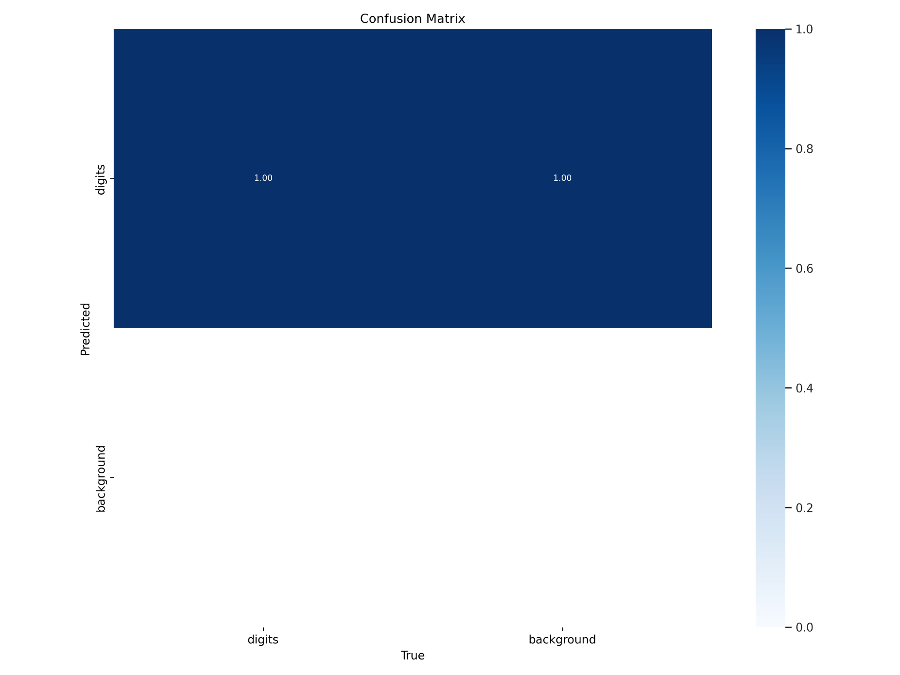
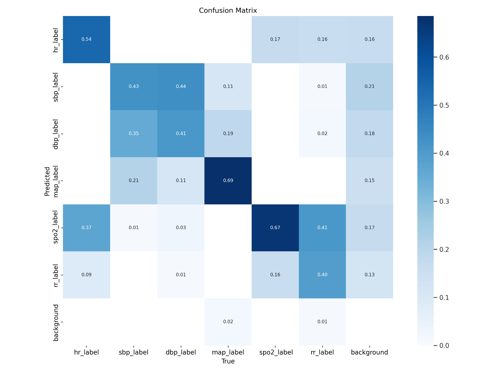

## Page 1
Instructions for Running the Jupyter Notebook
The main Jupyter/Google Colab notebook for this problem statement is 'final_pipeline.ipynb' and
it is divided into 6 sections. In the first section, the relevant libraries are installed and the models
are loaded. The dependencies were selected with consideration to the Google Colab
environment. It is important to upload the models directly in the '/content/' location and ensure
that the correct paths to the models are provided in the third cell. To initialise the different
variables and functions, all cells should be run once in the beginning. The last two sections
contain the inference function and digitization functions, which are to be called by passing the
location of the image as the parameter.
Abstract:
Medical vitals extraction from an image is a crucial yet time-consuming process. With the
growing popularity and efficacy of Artificial Intelligence (AI), a large section of the community
has started working on automating different healthcare activities, such as medical entity
extraction and X-ray processing. In this work, we propose and build a transfer learning-based
object segmentation incorporating a vital extraction model, which takes a monitor as input and
outputs different medical vitals like oxygen and heart rate. The model first identifies the monitor
segment, marks the region of interest for vitals, and finally recognizes the marked boxes with
their respective vital labels. Our proposed model is a pipelined approach that helps to locate
errors effectively and scale up easily. With the proposed model, we found that our model
identifies different vitals with reliable confidences ranging from 0.9 to 0.97. We also did a
thorough human evaluation, showing that our model can handle different uncertainties like
monitor angle, shape, and background colour.

## Page 2
Architecture:
Brief Description-
The model emulates the process of human vision in reading vitals. Like how a human would first
locate the monitor, then determine its type, identify digits based on position, size and colour, the
model follows the same process to accurately classify and report the readings. It starts by
detecting the monitor screen, classifying it based on the cropped image, and then using the
location of the digits to label the data which is then passed on to the OCR for reading and
reporting the results.
Monitor Segmenter
To identify the monitor from an image, we used YOLOv5 (You Only Look Once) which is a state
of the art model for quick object detection. The model will give us the x-center, y-center, height,
and width of the monitor it has detected, then we select the one with the maximum confidence
score and crop out the monitor and pass it to later stages.

## Page 3
Monitor Classifier
Once we found the bounding box of the monitor, we classified the monitor into four classes by
using K-means clustering. For this we used a deep learning model, Inception V3 which is based
on CNNs. This is documented as the image_feature function in the final pipeline which gives us
the label of the monitor as output. Using unsupervised learning through Inception V3 introduced
some novelty in our pipeline.
Digit Segmenter
To detect digits in monitor images, we utilised the YOLOv5 object detection system. This system
is designed for real-time object detection and is known for its speed and accuracy. The YOLOv5
model (loaded as digit_segmenter in the Colab notebook) was used to obtain the x-center,
y-center, height, and width of the detected digits. To prevent false positives, only the top 6 digits
were selected based on their confidence scores and were then cropped for further processing.
Vital Classification
The digit's location and size information obtained from the previous step is fed into an XGBoost
classifier to predict its vital type. XGBoost, a flexible and powerful ML model, uses decision
trees as its base learner and improves predictions through gradient boosting. This results in
accurate vital type classification based on digit position and size. The final dictionary object is
then easily populated with the key-value pairs obtained from OCR.
OCR
To detect text from images of various vitals, an OCR system is used. We used EasyOCR, which
employs deep learning algorithms for accurate and efficient text recognition. The final result is
returned in the form of a dictionary object.
Heart Rate Digitization
We trained a separate YOLOv5 model on the whole Classification Dataset to give HR graph
coordinates. We cropped the obtained image of the graph and used the Contour Detection
method to extract the coordinates of the graph using OpenCV library. Contour detection can be
explained simply as a curve joining all the continuous points (along with the boundary), having
the same colour or intensity. We did not use edge detection since it has some limitations. One of
the major limitations being, it cannot detect the whole graph if there is some noise present in
between the curve, of which we saw multiple examples.  We plotted the obtained coordinates
using Matplotlib.

## Page 4
Training and Other Details
Monitor Segmenter
To train the model we trained the yolov5 model on the 1800 of the 2000 image samples
provided and tested the model on the other 200 data. The training was done at 25 epoch with a
batch size of 8.
The following table summarises the efficacy of the model-
Precision
Recall
mAP50
mAP50-95
0.99
1
0.995
0.99
Monitor Classifier
We first tried using Microsoft’s Resnet-18 Convolutional Architecture for Monitor Classification,
but we realised we should be taking Monitor Layout as the key attribute/feature instead of
Monitor Type for classifying and this would be done better on unsupervised learning than
supervising it to only Monitor Types, so we switched to Inception V3. Using K-means clustering
through Inception V3, we were able to get 100% test and train accuracy on the given 1000
monitor classification images. We used this cluster data in our final pipeline.
Digit Segmenter
The objective of the model was to make it machine agnostic, hence we trained it on all four
classification datasets provided and treated all the vitals as the same class. To maximise digit
detection, the model was trained with a batch size of 10 and for 30 epochs. However, a
challenge arose when the model sometimes labelled the background as digits. To overcome
this, only the top 6 scores with the highest confidence were considered for digit classification.

## Page 5
Confusion Matrix for Digit Detection
The following table tabulates the validation parameters-
metrics/recall
metrics/mAP_0.5
metrics/mAP_0.5:0.95
val/box_loss
0.99627
0.9942
0.80342
0.015804
In our initial attempts we tried to get yolo to both segment and classify the labels. However the
results were discouraging and hence we abandoned this approach.

## Page 6
Confusion Matrix for Segmentation as well as classification using YOLOv5.
Vital Classification
To accurately classify the digits in the monitors, an XGBoost model was specifically trained for
each of the four monitor classes. The position and size of the digit's bounding box was used as
input features for the model to make predictions on its class. The model was trained on a total of
around 250x6 samples per class, with a grid search performed to optimise the hyperparameters
of n_estimators and max_depth for improved accuracy. The final accuracy results for each class
were reported on test data (80/20 split).
Monitor Class
Accuracy
BPL-Ultima-PrimeD-A-classification
100%
BPL-EliteView-EV10-B_Meditec-England-A
98.69%
BPL-EliteView-EV100-C
97.0%
Nihon-Kohden-lifescope
99%

## Page 7
OCR
EasyOCR was employed for text detection and addressed the common problem of detecting a
mixture of alphanumeric characters faced by other OCRs. It provides a feature that allows you
to specify certain characters for recognition and ignore others, leading to improved accuracy
and reduced extraneous information. EasyOCR, Pyterreact, and Calamari OCR were tested,
and EasyOCR showed better accuracy compared to the other two. Also before being passed to
OCR, we are increasing the sharpness and using auto brightness to remove glare in the image.
Heart Rate Digitization
We rotated the cropped image by an angle. This angle is the mean of lower and upper 40% of
all angles, which are made by lines joining the mean line and the peaks or the troughs. By doing
so we try to align all the peaks of the graph to get the same y-coordinate for all of the peaks.
Since there was some noise in the cropped image, we took the largest continuous contour to
get only the graph coordinates. Since Contour detects the border, it detects both the inner and
outer borders of the curve. This gives us multiple y-coordinates for a single x-coordinate. We
tried various methods to get a single y-coordinate for a given x-coordinate such as max, mean
and min. We found mean works the best in such cases. Hence we finally plot the obtained pairs
of (x,y) coordinates.
Conclusion
In this study, we aimed to tackle the challenge of accurately recognizing and digitising heart rate
and reading the vitals from various monitoring devices in low-resource settings. Our work makes
a contribution in this direction by demonstrating use of open source models and data to achieve
satisfactory performance on the trained dataset. As future work, efforts can be directed towards
developing zero-shot or few-shot solutions to address this problem.

